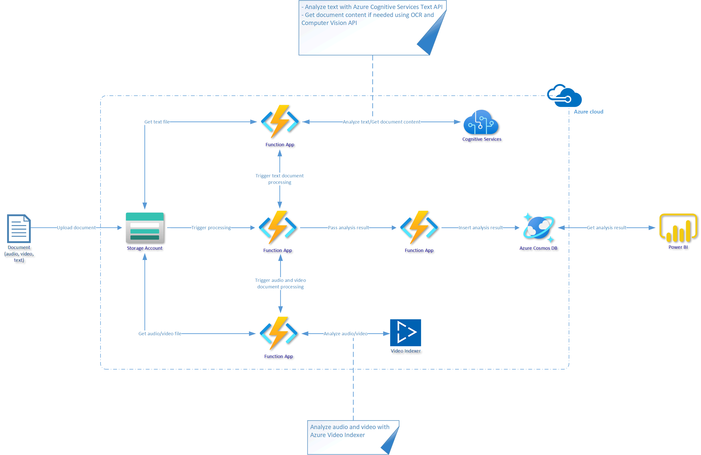
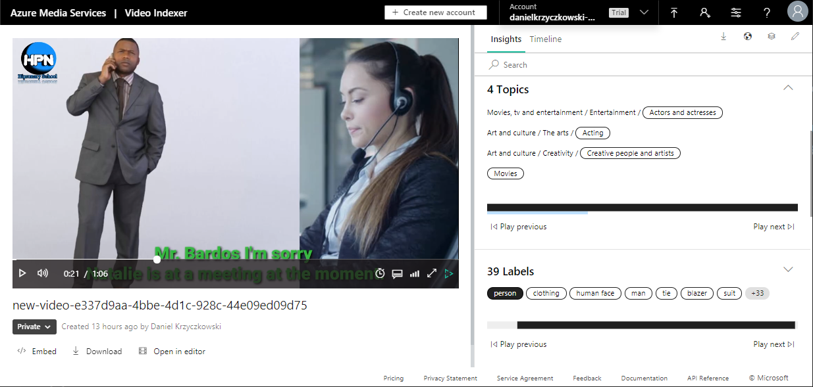
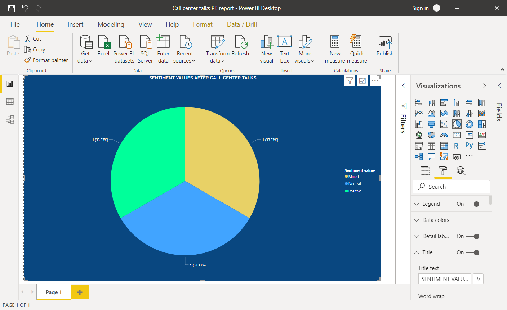

# Call Center Talks Analysis

## Introduction

This repository contains source code and guides how to build call center talks analysis solution with Azure Storage Account, Azure Function Apps, Azure Cognitive Services, Azure Video Indexer, Azure Cosmos DB, and PowerBI.

## Business case

We need a solution to get insights related to call center talks.

1. We would like to improve contact with our customers based on the analysis of recorded audio and video or chat history
2. We would like to know what is the average time of the conversation with the customer in our call center
3. We would like to count how many customers are satisfied with the help which is given during the conversation with the call center's assistant
4. What are the most popular topics of conversations

## Solution

The below diagram presents a solution built on the Microsoft Azure cloud that enables uploading PDF files with conversation history or audio/video files of the recorded conversation.

### Components used:

1. Azure Storage Account (Blob Storage)
2. Azure Durable Functions (with [Fan out/Fan in pattern used](https://docs.microsoft.com/en-us/azure/azure-functions/durable/durable-functions-overview?tabs=csharp#fan-in-out))
3. Azure Cognitive Services Text Analytics (to apply [sentiment analysis](https://docs.microsoft.com/en-us/azure/cognitive-services/text-analytics/overview#sentiment-analysis))
4. Azure Cognitive Services Computer Vision (to apply [OCR scan](https://docs.microsoft.com/en-us/azure/cognitive-services/computer-vision/quickstarts/csharp-print-text) on PDF files)
5. Azure Video Indexer (to [analyze audio and video](https://docs.microsoft.com/en-us/azure/media-services/video-indexer/video-indexer-overview) content)
6. Azure Cosmos DB (to store analysis results as [JSON documents](https://docs.microsoft.com/en-us/azure/cosmos-db/introduction))
7. Power BI (to [visualize collected data](https://powerbi.microsoft.com/en-us/desktop/) in a form of report)

### Flow:

1. Audio/video or PDF file is uploaded to the Azure Blob Storage
2. Azure Function is triggered once the new file is uploaded
3. File extension is verified by FileAnalysisOrchestrator function and basing on the file content type, either TextFileAnalyzer function is triggered (for PDF files) or AudioVideoFileAnalyzer function is triggered (for the audio and video files). FileAnalysisOrchestrator function app is responsible for orchestration of the the process related to calling specific function and getting analysis result so it can be passed to the third function app (AnalysisResultAggregator) responsible for inserting data into the Cosmos DB container
4. Once data is collected, in the Power BI Desktop application we can set Cosmos DB as data source and display data using different charts

