# Document Analyzer

This repository contains source code and guide how to build document analyzer with Function App, Form Recognizer, Logic App and Cosmos DB.

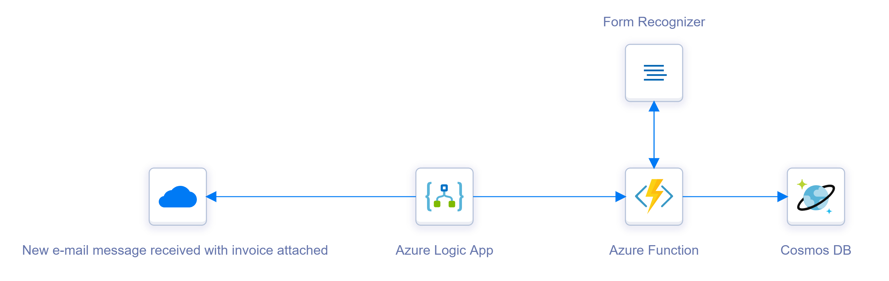

## Prepare resource group with Azure services

Below image presents azure services used in the solution:

## Train Form Recognizer model

Please use [this](https://docs.microsoft.com/en-us/azure/cognitive-services/form-recognizer/quickstarts/label-tool) instructions to setup labeling tool and train Form Recognizer model.

Below steps show how Form Recognizer model was trained:

1. Upload [test](https://github.com/Daniel-Krzyczkowski/AzureAI/blob/master/src/document-analyzer/sample_data.zip) files to the Azure Blob Storage:

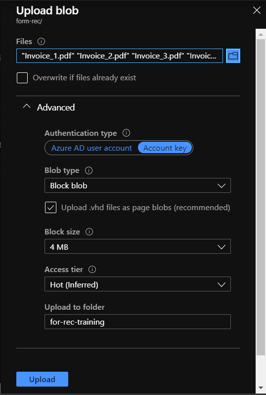

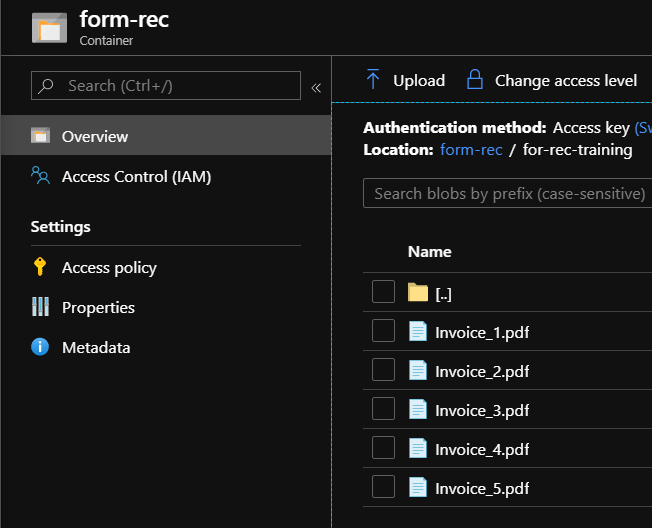

2. Setup Form Recognizer model:

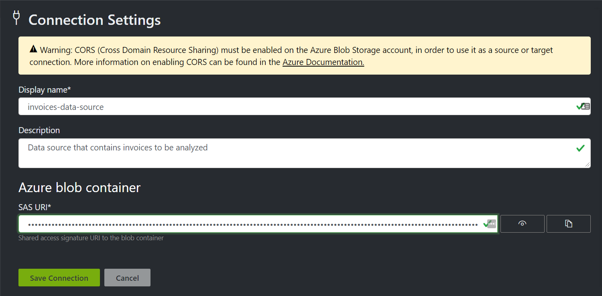

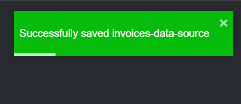

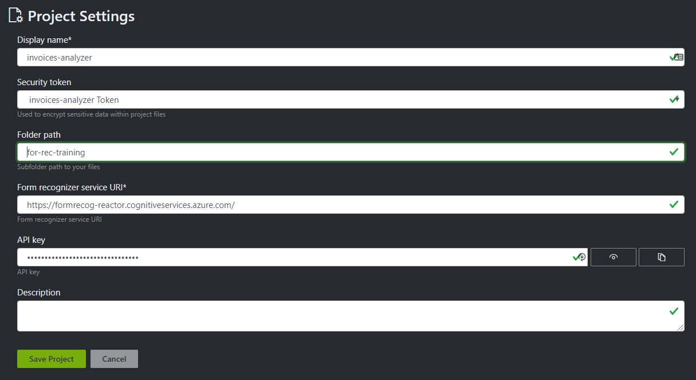

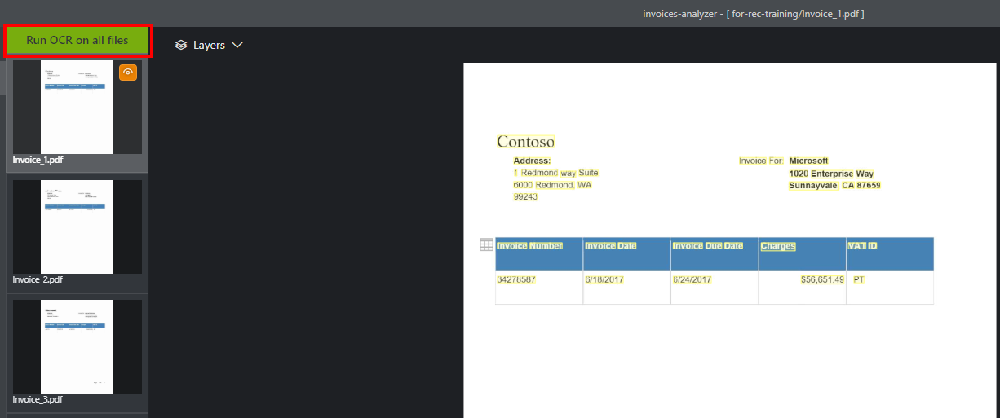

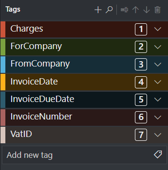

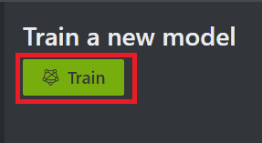

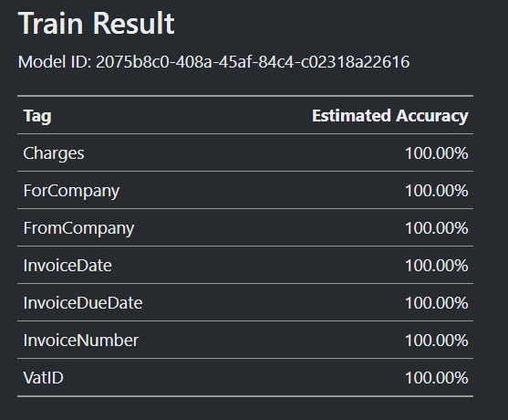

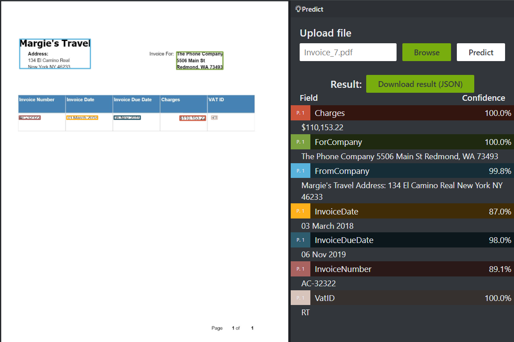

## Setup Azure Function App

Azure Function App source code for processing and inserting data to the Cosmos DB is available in [this](https://github.com/Daniel-Krzyczkowski/AzureAI/tree/master/src/document-analyzer/src) repository.

## Setup Azure Logic App

Below steps show how Azure Logic App is configured:

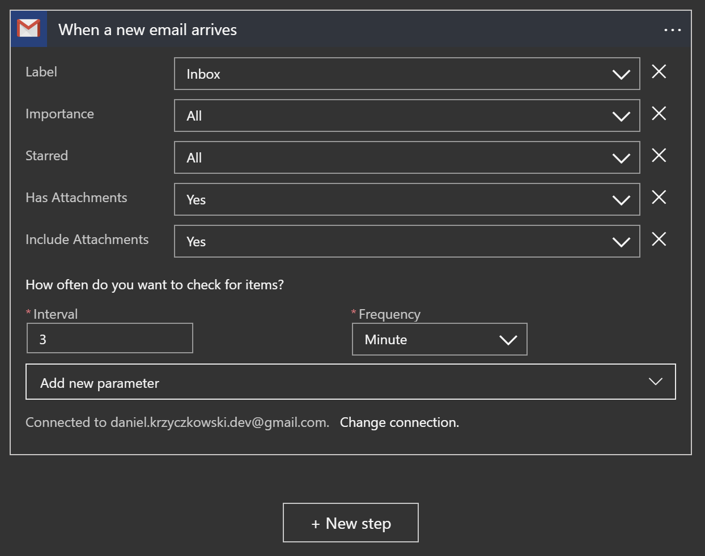

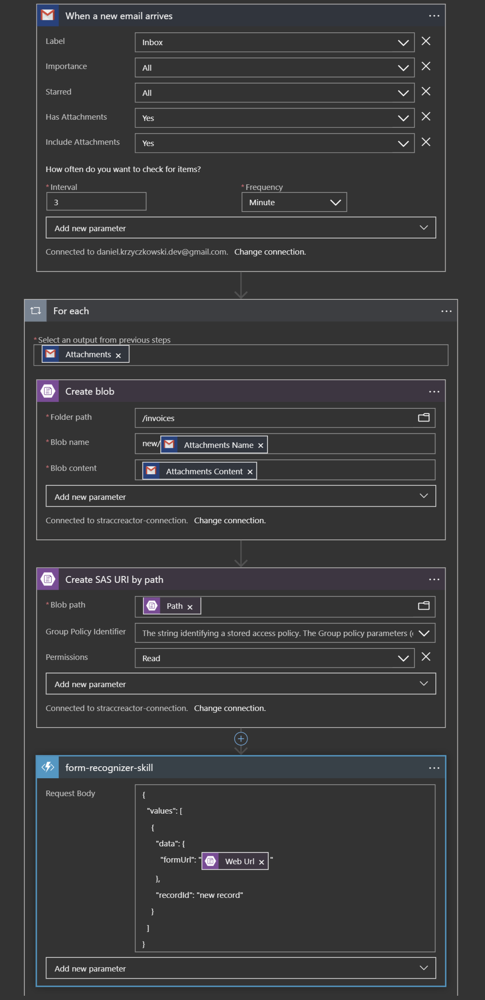

